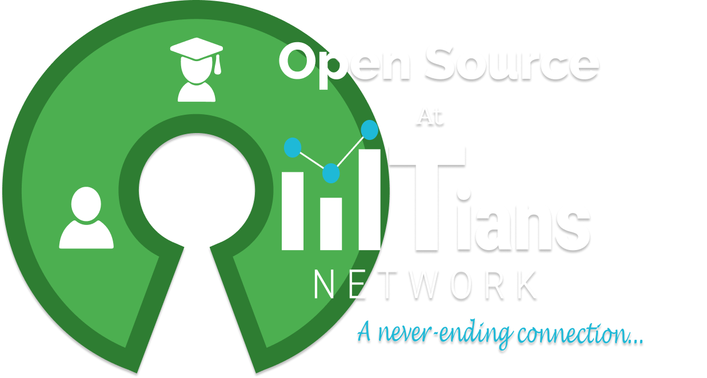

# Open Source Project under IIITian Networks

## Why contribute to open source??
Contributing to open source can be a rewarding way to learn, teach, and build experience in just about any skill you can imagine.
- Improve software you rely on
- Improve existing skills
- Meet people who are interested in similar things
- Find mentors and teach others
- It’s empowering to be able to make changes, even small ones

## What it means to contribute?
don’t have to contribute code, A common misconception about contributing to open source is that you need to contribute code.You can
- Answer questions about the project on e.g., Stack Overflow or Reddit.
- Answer questions for people on open issues
- Review code on other people’s submissions
- Help moderate the discussion boards or conversation channels

## How to contribute in such Open Source Project
8% of casual contributions to open source are documentation, such as a typo fix, reformatting, or writing a translation.You Just need track issues related to the project And try to solve that issues And Open Pull Request.

List of Open Source Projects

- ## Noob-Developers
  Details of Noob Developer
  
  [Demo link]()
  [code link]()

- ## Master-Portfolio
  A clean, beautiful, responsive and 100% customizable portfolio template for Developers!

  [Demo link](https://vima.netlify.app/)
  [code link](https://github.com/vimalverma558/Master-Portfolio)
  [website](https://master-portfolio.js.org/)

- ## Website of IIITians Networks</H2>
  IIITians Networks Website
  
    - <a href="https://github.com/IIITians-Network/Home-Page-Website">IIITians Network Home Page</a>
    - <a href="https://github.com/IIITians-Network/Counselling">Counselling Section</a>
    - <a href="https://github.com/IIITians-Network/Placement">Placement Section</a>
    - <a href="https://github.com/IIITians-Network/Team">IIITians Team Page</a>
    - <a href="https://agartala.iiitiansnetwork.com/">IIIT Agartala</a>
    - <a href="https://allahabad.iiitiansnetwork.com/">IIIT Allahabad</a>
    - <a href="https://bhagalpur.iiitiansnetwork.com/">IIIT Bhagalpur</a>
    - <a href="https://bhopal.iiitiansnetwork.com/">IIIT Bhopal</a>
    - <a href="https://dharward.iiitiansnetwork.com/">IIIT Dharward</a>
    - <a href="https://guwahati.iiitiansnetwork.com/">IIIT Guwahati</a>
    - <a href="https://gwalior.iiitiansnetwork.com/">IIITM Gwalior</a>
    - <a href="https://jabalpur.iiitiansnetwork.com/">IIITDM Jabalpur</a>
    - <a href="https://kalyani.iiitiansnetwork.com/">IIIT Kalyani</a>
    - <a href="https://kancheepuram.iiitiansnetwork.com/">IIITDM Kancheepuram</a>
    - <a href="https://kota.iiitiansnetwork.com/">IIIT Kota</a>
    - <a href="https://kottayam.iiitiansnetwork.com/">IIIT Kottayam</a>
    - <a href="https://kurnool.iiitiansnetwork.com/">IIITDM Kurnool</a>
    - <a href="https://lucknow.iiitiansnetwork.com/">IIIT Lucknow</a>
    - <a href="https://manipur.iiitiansnetwork.com/">IIIT Manipur</a>
    - <a href="https://nagpur.iiitiansnetwork.com/">IIIT Nagpur</a>
    - <a href="https://pune.iiitiansnetwork.com/">IIIT Pune</a>
    - <a href="https://raichur.iiitiansnetwork.com/">IIIT Raichur</a>
    - <a href="https://ranchi.iiitiansnetwork.com/">IIIT Ranchi</a>
    - <a href="https://sonepat.iiitiansnetwork.com/">IIIT Sonepat</a>
    - <a href="https://sricity.iiitiansnetwork.com/">IIIT Sri City</a>
    - <a href="https://surat.iiitiansnetwork.com/">IIIT Surat</a>
    - <a href="https://tiruchirapalli.iiitiansnetwork.com/">IIIT Tiruchirapalli</a>
    - <a href="https://una.iiitiansnetwork.com/">IIIT Una</a>
    - <a href="https://vadodra.iiitiansnetwork.com/">IIIT Vadodara</a>
    

- ## Have an idea !
  If you have an idea, want a team to start. You are always welcome.
  Send a mail describing your project and we will add you to the organization, where you can create your own team and start working with fellow IIITians.
  Send the mail at contact@iiitiansnetwork.com , iiitiansnetwork@gmail.com, or just raise a issue on this repository describing your idea. 
<!-- - ## Prime-num
  prime-num is an math library for JavaScript and Node.js. It help you to find all prime number.  
  
  [Demo link](https://www.npmjs.com/package/prime-num)
  [code link](https://github.com/letskhabar/prime-num) -->

